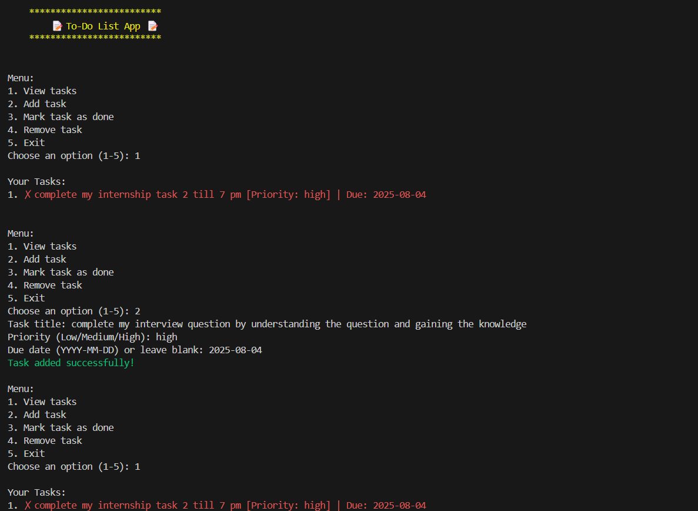

# 📝 CLI To‑Do List App (Python)

A colorful command-line To‑Do List manager that lets you add, view, mark, and remove tasks — and keeps them saved even after you exit.

## ✨ Features
- Add new tasks with optional priority (Low / Medium / High)
- Mark tasks as done ✅
- Remove tasks from the list
- View all tasks neatly (with colored status and optional due dates)
- Persistent storage → saves tasks to a text file (`tasks.txt`)
- Colorful CLI interface with ASCII art title

## 📸 Screenshot



## 🚀 How to Run

```bash
# Clone the repository
git clone https://github.com/SangitaPatro/To-Do-list.git

# Install required libraries
pip install colorama

# Run the app
python todo.py

🧠 Code Explanation
todo.py is the main Python script containing the full code.
The app is designed using two classes:
Task: represents each task and keeps details like:
-Title (task name)
-Status (done or not done)
-Priority (Low / Medium / High)
-Optional due date
TodoList: manages the list of tasks and contains functions to:
-add_task(): add a new task to the list
-remove_task(): remove a task by its number
-mark_done(): mark a task as done
-view_tasks(): display all tasks nicely with colors
-save_to_file(): save tasks to tasks.txt so data stays even after exit
-load_from_file(): load tasks from tasks.txt when starting the app.
All tasks are kept in memory as a Python list while the app runs. The CLI shows a menu (using while True) so you can keep doing multiple operations until you choose Exit. colorama is used to color:✓ in green for completed tasks.✗ in red for pending tasks. pyfiglet can print a fancy ASCII art title at the top. When you add/remove/mark tasks, they are immediately saved to tasks.txt using Python’s built‑in open() function. When you restart the app, it automatically loads your saved tasks → making the to‑do list persistent. The app also handles invalid input (e.g., if user types wrong number or wrong date format).This way, it stays simple, console-based, and exactly meets the task requirements — but with small extra touches like priority, status, and color to make it unique.

📂 Files
todo.py: main Python script
tasks.txt: auto‑generated text file to store tasks
README.md: this file
screenshots/: folder with screenshots of terminal output

Made by Sangita kankal
